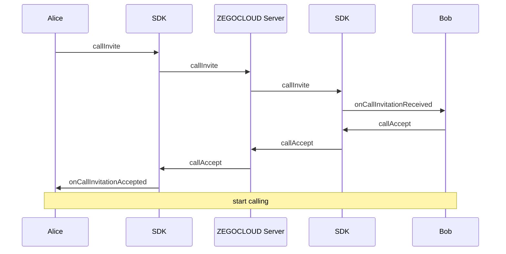
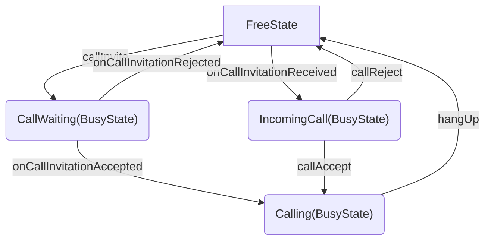

see https://docs.zegocloud.com/article/15663

# 实现呼叫邀请功能

本文将介绍如何实现通话场景下的呼叫邀请功能，在实现该功能之前，需参考 [QuickStart]() 完成 SDK 接入及基础通话功能。

## 前提条件

1. 参考[QuickStart]()完成基本的通话功能。
2. 下载本文档配套[Demo](https://github.com/ZEGOCLOUD/zegocloud_sdk_demos/blob/main/call/advanced_features/call_with_invitation/android/)
3. Subscribe to the **In-app Chat** service.


## 效果预览

您可以通过本文档提供的[Demo](https://github.com/ZEGOCLOUD/zegocloud_sdk_demos/blob/main/call/advanced_features/call_with_invitation/android/)来预览实现效果，具体展示如下：

|Home Page|Incoming Call Dialog|Waiting Page|Calling Page|
|--- | --- | --- |--- |
|||||


## 原理说明

我们可以基于`in-app chat(后文称 ZIM SDK)`提供的[Call invitation (signaling)](https://docs.zegocloud.com/article/14243)功能来实现呼叫邀请，which provides the capability of call invitation, allowing you to send, cancel, accept, and refuse a call invitation. 


基于 ZIM SDK 实现的呼叫邀请以"Alice 呼叫 Bob ，Bob 同意并接通通话"为例流程图如下：




以下是方案简介：

1. caller 可以通过调用 `callInvite` 接口向指定的用户发送呼叫邀请，调用成功后，等待 callee 的响应。
    - 当callee接受呼叫邀请时，caller会收到 `onCallInvitationAccepted` 回调。
    - 当callee拒绝呼叫邀请时，caller会收到 `onCallInvitationRejected` 回调。
    - 当callee未响应超时时，caller会收到 `onCallInviteesAnsweredTimeout` 回调。
    - caller 在等待期间可以调用`callCancel`来取消这次呼叫邀请
2. callee 收到呼叫邀请时会收到`onCallInvitationReceived`回调，callee可以选择接受或拒绝，或不响应这个呼叫。
    - 若callee想接受呼叫邀请，可以调用 `callAccept` 接口
    - 若callee想接受呼叫邀请，可以调用 `callReject` 接口
    - 当caller拒绝呼叫邀请时，callee会收到 `onCallInvitationCancelled` 回调。
    - 当callee未响应超时时，caller会收到 `onCallInvitationTimeout` 回调。
3. callee接受邀请，则双方开始通话。


后面本文档将对完整的呼叫流程进行详细的讲述。

<details class="zg-primary">
    <summary>SDK相关接口及类型定义</summary>

[接口：](todo 跳转到zim的接口文档)


```java
void callInvite(List<String> invitees, ZIMCallInviteConfig config, ZIMCallInvitationSentCallback callback);

void callCancel(List<String> invitees, String callID, ZIMCallCancelConfig config, ZIMCallCancelSentCallback callback);

void callAccept(String callID, ZIMCallAcceptConfig config, ZIMCallAcceptanceSentCallback callback);

void callReject(String callID, ZIMCallRejectConfig config, ZIMCallRejectionSentCallback callback);

```

[回调：](todo 跳转到zim的接口文档)

```java
public void onCallInvitationReceived(ZIM zim, ZIMCallInvitationReceivedInfo info, String callID) {}

public void onCallInvitationCancelled(ZIM zim, ZIMCallInvitationCancelledInfo info, String callID) {}

public void onCallInvitationAccepted(ZIM zim, ZIMCallInvitationAcceptedInfo info, String callID) {}

public void onCallInvitationRejected(ZIM zim, ZIMCallInvitationRejectedInfo info, String callID) {}

public void onCallInvitationTimeout(ZIM zim, String callID) {}

public void onCallInviteesAnsweredTimeout(ZIM zim, ArrayList<String> invitees, String callID) {}
```

</details>

## 方案详情

### 集成并开始使用zim sdk

如果您未使用过zim sdk，您可以阅读一下以下部分：

<details class="zg-primary">
    <summary>1. Import the ZIM SDK</summary>

首先，您需要引入sdk：

1. Set up repositories

    - If your Android Gradle Plugin is **v7.1.0 or later**: go to the root directory of your project, open the `settings.gradle` file, and add the following line to the `dependencyResolutionManagement`:

        ```groovy
        ...
        dependencyResolutionManagement {
            repositoriesMode.set(RepositoriesMode.FAIL_ON_PROJECT_REPOS)
            repositories {
                maven { url 'https://storage.zego.im/maven' }
                mavenCentral()
                google()
            }
        }
        ```

        <div class="mk-warning">

        If you can not find the above fields in `settings.gradle`, it's probably because your Android Gradle Plugin version is lower than v7.1.0.

        For more details, see [Android Gradle Plugin Release Note v7.1.0\|_blank](https://developer.android.com/studio/past-releases/past-agp-releases/agp-7-1-0-release-notes#settings-gradle).
        </div>

    - If your Android Gradle Plugin is **earlier than 7.1.0**: go to the root directory of your project, open the `build.gradle` file, and add the following line to the `allprojects`:

        ```groovy
        ...
        allprojects {
            repositories {
                maven { url 'https://storage.zego.im/maven' }
                mavenCentral()
                google()
            }
        }
        ```

2. Declare dependencies:

    Go to the `app` directory, open the `build.gradle` file, and add the following line to the `dependencies`. (**x.y.z** is the SDK version number, to obtain the latest version number, see [Release Note\|_blank](#12167))

    ```groovy
    ...
    dependencies {
        ...
        implementation 'im.zego:zim:x.y.z'
    }
    ```
</details>

<details class="zg-primary">
    <summary>2. 创建并管理 SDK instance</summary>

引入成功后，您便可以使用zim sdk了，像这样

```java
import im.zego.zim.ZIM
```

Creating a ZIM instance is the very first step, an instance corresponds to a user logging in to the system as a client.
```java
ZIMAppConfig appConfig = new ZIMAppConfig();
appConfig.appID = yourAppID;
appConfig.appSign = yourAppSign;
zim = ZIM.create(appConfig, application);
```

</details>

后文会为您详细介绍，如何使用 zim sdk 完成呼叫邀请功能的开发，


### 更简单地管理多个SDK

For most cases, 您需要一起使用多个sdk，比如在本文的呼叫邀请场景中，需要使用 zim sdk 来实现呼叫邀请功能，而后，需要使用 zego_express_engine sdk 来实现通话功能。

如果您的app到处都有对sdk的直接调用, 会导致代码难以管理且难以排查问题，为了让您的app代码更加井井有条，我们为您推荐以下方式来管理这些sdk：

1. 您可以为每个sdk创建一个封装层，以便您可以最大程度地复用代码。

我们可以为zim sdk创建一个ZIMService类，由这个类来管理与zimsdk的交互并存储必要的数据。完整代码请参考[ZIMService.java](https://github.com/ZEGOCLOUD/zegocloud_sdk_demos/blob/main/call/advanced_features/call_with_invitation/android/app/src/main/java/com/zegocloud/demo/callwithinvitation/internal/ZIMService.java)
```java
public class ZIMService {
    private ZIM zim;
    
    // ...

    public void initSDK(Application application, long appID, String appSign) {
        if (zim != null) {
            return;
        }
        ZIMAppConfig zimAppConfig = new ZIMAppConfig();
        zimAppConfig.appID = appID;
        zimAppConfig.appSign = appSign;
        zim = ZIM.create(zimAppConfig, application);
        if (zim != null) {
            zim.setEventHandler(new ZIMEventHandler() {
               
               // ...

            });
        }
    }
}
```

同样的，我们可以为 zego_express_engine sdk创建一个ExpressService类，由这个类来管理与 zego_express_engine sdk 的交互并存储必要的数据。完整代码请参考[ExpressService.java](https://github.com/ZEGOCLOUD/zegocloud_sdk_demos/blob/main/call/advanced_features/call_with_invitation/android/app/src/main/java/com/zegocloud/demo/callwithinvitation/internal/ExpressService.java)

```java
public class ExpressService {
    private ZegoExpressEngine express;

    // ...
    public void initSDK(Application application, long appID, String appSign) {
        if (engine != null) {
            return;
        }
        
        ZegoEngineProfile profile = new ZegoEngineProfile();
        profile.appID = appID;
        profile.appSign = appSign;
        profile.scenario = ZegoScenario.DEFAULT;
        profile.application = application;
        
        express = ZegoExpressEngine.createEngine(profile, new IZegoEventHandler() {
            // ...
        });
    }
}
```

有了service之后，我们需要使用任何sdk接口时，都可以为service增加方法。

<details class="zg-primary">
    <summary>例如我们需要实现登录时，就可以轻松为ZIMService增加connectUser方法。</summary>

```java
public class ZIMService {
    // ...
    public void connectUser(String userID, String userName, ZIMLoggedInCallback callback) {
        if (zim == null) {
            return;
        }
        ZIMUserInfo zimUserInfo = new ZIMUserInfo();
        zimUserInfo.userID = userID;
        zimUserInfo.userName = userName;
        zim.login(zimUserInfo, new ZIMLoggedInCallback() {
            @Override
            public void onLoggedIn(ZIMError errorInfo) {
                // ...
            }
        });
    }
}
```

</details>

2. 完成service的封装后，我们可以进一步简化我们的代码，我们可以创建一个`ZEGOSDKManager`来统一管理这些service，如下所示, 完整代码请参考[ZEGOSDKManager.java](https://github.com/ZEGOCLOUD/zegocloud_sdk_demos/blob/main/call/advanced_features/call_with_invitation/android/app/src/main/java/com/zegocloud/demo/callwithinvitation/ZEGOSDKManager.java#L25)
```java
public class ZEGOSDKManager {
    public ExpressService expressService = new ExpressService();
    public ZIMService zimService = new ZIMService();
    
    private static final class Holder {
        private static final ZEGOSDKManager INSTANCE = new ZEGOSDKManager();
    }

    public static ZEGOSDKManager getInstance() {
        return Holder.INSTANCE;
    }

    public void initSDK(Application application, long appID, String appSign) {
        expressService.initSDK(application, appID, appSign);
        zimService.initSDK(application, appID, appSign);
    }
}
```

这样我们就实现了一个singleton类，这个类管理了我们所需要的sdk的service。从现在开始，您可以在您项目的任何地方获取到这个类的实例，并通过该类来执行与sdk相关的逻辑，如：

- 在app启动时，调用`ZEGOSDKManager.getInstance().initSDK(application,appID,appSign);`
- 在开始通话时，调用`ZEGOSDKManager.getInstance().joinExpressRoom(roomID,callback);`
- 在结束通话时，调用`ZEGOSDKManager.getInstance().leaveExpressRoom();`

后续我们将基于这个架构来为您介绍如何添加呼叫邀请功能。

### 发送呼叫邀请

1. 传递扩展信息

caller在发起呼叫时，除了需要指定callee之外，给callee传递信息，比如用来约定使用视频通话还是纯音频通话等。

`callInvite`接口的`ZIMCallInviteConfig`参数允许我们传递一个字符串类型的扩展信息`extendedData`，这个扩展信息将会传递给callee，我们可以使用这种方式来让caller给callee传递任何需要的信息。

在方案示例Demo中，我们使用 `CallInviteExtendedData` 类型来定义呼叫邀请的extendedData，并在发起呼叫时将其按 Json 格式转换为 String 传递给 callee。(详见[完整源码](https://github.com/ZEGOCLOUD/zegocloud_sdk_demos/blob/main/call/advanced_features/call_with_invitation/android/app/src/main/java/com/zegocloud/demo/callwithinvitation/call/internal/CallInviteExtendedData.java)), CallInviteExtendedData附带了呼叫类型，以及caller的名字。
```java
public class CallInviteExtendedData {
    public String type;
    public String callerUserName;
    public static final String TYPE_VIDEO_CALL = "video_call";
    public static final String TYPE_VOICE_CALL = "voice_call";
}
```

> 注意: caller需要通过检查`onCallInvitationSent`中的`errorInfo`来判断是否呼叫成功，并处理呼叫失败的异常情况，例如手机断网导致呼叫失败等情况。


2. 实现呼叫等待页面

- 在呼叫场景中，caller发出呼叫后，需要进入呼叫等待页面，在这个页面中我们来监听呼叫邀请的状态变化，详见[完整源码](https://github.com/ZEGOCLOUD/zegocloud_sdk_demos/blob/main/call/advanced_features/call_with_invitation/android/app/src/main/java/com/zegocloud/demo/callwithinvitation/call/CallWaitingActivity.java), 关键代码如下：


```java
public class CallWaitingActivity extends AppCompatActivity {
    private InvitationListener listener = new InvitationListener() {
       // ...
    }

    @Override
    protected void onCreate(Bundle savedInstanceState) {
        super.onCreate(savedInstanceState);
        // ...
        ZEGOSDKManager.getInstance().addInvitationListener(listener);
        // ...
    }
}
```
- 当对方接听时，进入calling页面开始通话

```java
public class CallWaitingActivity extends AppCompatActivity {
    // ...
    private InvitationListener listener = new InvitationListener() {
        @Override
        public void onOutgoingCallInvitationAccepted(String callID, String invitee, String extendedData) {
            ZEGOSDKManager.getInstance().joinExpressRoom(callID, new IZegoRoomLoginCallback() {
                @Override
                public void onRoomLoginResult(int errorCode, JSONObject extendedData) {
                    if (errorCode == 0) {
                        finishAndExit();
                        CallingActivity.startActivity(CallWaitingActivity.this, callInviteInfo);
                    } else {
                        ToastUtil.show(CallWaitingActivity.this, "joinexpressRoom failed :" + errorCode);
                    }
                }
            });
        }
        // ...
    }
    // ...
}
```

- 当对方拒绝，则结束这次呼叫，返回上一页面；同样的，当对方超时未响应，也结束这次呼叫返回上一页面。
```java
public class CallWaitingActivity extends AppCompatActivity {
    // ...
    private InvitationListener listener = new InvitationListener() {
        @Override
        public void onOutgoingCallInvitationRejected(String callID, String invitee, String extendedData) {
            ToastUtil.show(CallWaitingActivity.this,"reject by user, extendedData:" + extendedData);
            finishAndExit();
        }

        @Override
        public void onOutgoingCallInvitationTimeout(String callID, ArrayList<String> invitees) {
            ToastUtil.show(CallWaitingActivity.this,"call invitation timeout");
            finishAndExit();
        }
        // ...
    }
    // ...
}
```

- 发起呼叫后，zaicaller可以随时通过`callCancel`接口随时取消呼叫。
> 在`callCancel`接口中要求传递一个`callID`，`callID`是一次呼叫邀请的唯一标识，可以从`callInvite`接口的`ZIMCallInvitationSentCallback`参数中获取到。
```java
public class CallWaitingActivity extends AppCompatActivity {
    // ...
    @Override
    protected void onCreate(Bundle savedInstanceState) {
        // ...
        binding.outgoingCallCancelButton.setOnClickListener(v -> {
            ZEGOSDKManager.getInstance()
                .cancelInvite(callInviteInfo.calleeUserID, callInviteInfo.callID, new ZIMCallCancelSentCallback() {
                    @Override
                    public void onCallCancelSent(String callID, ArrayList<String> errorInvitees, ZIMError errorInfo) {
                        if (errorInfo.getCode() == ZIMErrorCode.SUCCESS) {
                            finishAndExit();
                        } else {
                            ToastUtil.show(CallWaitingActivity.this, "cancel invite failed :" + errorInfo.getCode());
                        }
                    }
                });
        });
        // ...
    }
    // ...
}
```


<details class="zg-primary">
    <summary>SDK相关接口及类型定义</summary>

`callInvite`:
```java
void callInvite(List<String> invitees, ZIMCallInviteConfig config, ZIMCallInvitationSentCallback callback);
```

`ZIMCallInviteConfig`:
```java
public class ZIMCallInviteConfig {
    public int timeout = 90;
    public String extendedData = "";
    public ZIMPushConfig pushConfig;
    public ZIMCallInviteConfig() {}
}
```

`ZIMCallInvitationSentCallback`：
```java
public interface ZIMCallInvitationSentCallback {
    void onCallInvitationSent(String callID, ZIMCallInvitationSentInfo info, ZIMError errorInfo);
}
```

`ZIMCallInvitationSentCallback` 中的 `ZIMCallInvitationSentInfo`：

```java
public class ZIMCallInvitationSentInfo {
    public int timeout;
    public ArrayList<ZIMCallUserInfo> errorInvitees;
    public ZIMCallInvitationSentInfo() {}
}
```
</details>

### 响应呼叫邀请

当 callee 收到呼叫邀请时，会收到`onCallInvitationReceived`回调
1. callee 可以调用`callAccept` 或 `callReject` 来接受或拒绝这次呼叫邀请。
2. callee 可以在 `ZIMCallInvitationReceivedInfo` 中获取到 caller 传递的 `extendedData`
3. callee 在拒绝或接受呼叫邀请时，可以通过接口中的config参数来给caller传递附加信息，例如给caller传递拒绝原因是用户拒绝还是占线。

> 注意：callee调用接受或拒绝接口时，需要通过检查`callback`的`errorInfo`来判断是否响应成功并处理异常情况，例如手机断网等响应失败的情况。

后面将结合Demo代码来说明如何实现这部分功能

1. callee收到呼叫邀请时

- 非busy状态下会唤起`IncomingCallDialog`，让终端用户来决定接受或拒绝这次呼叫。
- busy状态下会自动拒绝邀请，并告知caller本端状态是busy。

详见[完整源码](https://github.com/ZEGOCLOUD/zegocloud_sdk_demos/blob/main/call/advanced_features/call_with_invitation/android/app/src/main/java/com/zegocloud/demo/callwithinvitation/call/CallBackgroundService.java#L31)，关键代码如下：
```java
public void onIncomingCallInvitationReceived(String callID, String userID, String extendedData) {
    if (ZEGOSDKManager.getInstance().isBusy()) {
        ZEGOSDKManager.getInstance().autoRejectCallInviteCauseBusy(callID, new ZIMCallRejectionSentCallback() {
            @Override
            public void onCallRejectionSent(String callID, ZIMError errorInfo) {
                ToastUtil.show(getApplicationContext(), "busy");
            }
        });
        return;
    }
    ZEGOSDKManager.getInstance().setBusy(true);

    CallInviteExtendedData callInviteExtendedData = CallInviteExtendedData.parseExtendedData(extendedData);
    CallInviteInfo callInviteInfo = new CallInviteInfo();
    callInviteInfo.callID = callID;
    callInviteInfo.callerUserID = userID;
    callInviteInfo.callerUserName = callInviteExtendedData.callerUserName;
    callInviteInfo.calleeUserID = ZEGOSDKManager.getInstance().expressService.getUserInfo().userID;
    callInviteInfo.callType = callInviteExtendedData.type;
    callInviteInfo.isOutgoingCall = false;

    Intent intent = new Intent(getApplicationContext(), IncomingCallDialog.class);
    intent.putExtra("callInviteInfo", callInviteInfo);
    intent.addFlags(Intent.FLAG_ACTIVITY_NEW_TASK);
    startActivity(intent);
}
```

2. 弹出`IncomingCallDialog`后, 当用户点击接受按钮时，调用`callAccept`，并进入CallingPage。详见[完整源码](https://github.com/ZEGOCLOUD/zegocloud_sdk_demos/blob/main/call/advanced_features/call_with_invitation/android/app/src/main/java/com/zegocloud/demo/callwithinvitation/call/IncomingCallDialog.java#L100)，关键代码如下：
```java
public class IncomingCallDialog extends AppCompatActivity {
    // ...
    @Override
    protected void onCreate(Bundle savedInstanceState) {
        // ...
        binding.dialogCallAccept.setOnClickListener(v -> {
            ZEGOSDKManager.getInstance().callAccept(callInviteInfo.callID, new ZIMCallAcceptanceSentCallback() {
                @Override
                public void onCallAcceptanceSent(String callID, ZIMError errorInfo) {
                    if (errorInfo.getCode() == ZIMErrorCode.SUCCESS) {
                        ZEGOSDKManager.getInstance().joinExpressRoom(callID, new IZegoRoomLoginCallback() {
                            @Override
                            public void onRoomLoginResult(int errorCode, JSONObject extendedData) {
                                if (errorCode == 0) {
                                    finish();
                                    CallingActivity.startActivity(IncomingCallDialog.this, callInviteInfo);
                                } else {
                                    ToastUtil.show(IncomingCallDialog.this, "joinExpressRoom failed :" + errorCode);
                                }
                            }
                        });
                    } else {
                        ToastUtil.show(IncomingCallDialog.this, "callAccept failed :" + errorInfo.getCode());
                    }
                }
            });
        });
        // ...
    }
    // ...
}
```

3. 弹出`IncomingCallDialog`后, 当用户点击拒绝按钮时，调用`callReject`，详见[完整源码](https://github.com/ZEGOCLOUD/zegocloud_sdk_demos/blob/main/call/advanced_features/call_with_invitation/android/app/src/main/java/com/zegocloud/demo/callwithinvitation/call/IncomingCallDialog.java#L123)，关键代码如下：

```java
public class IncomingCallDialog extends AppCompatActivity {
    // ...
    @Override
    protected void onCreate(Bundle savedInstanceState) {
        // ...
            binding.dialogCallDecline.setOnClickListener(v -> {
                ZEGOSDKManager.getInstance().callReject(callInviteInfo.callID, new ZIMCallRejectionSentCallback() {
                    @Override
                    public void onCallRejectionSent(String callID, ZIMError errorInfo) {
                        if (errorInfo.getCode() == ZIMErrorCode.SUCCESS) {
                        } else {
                            ToastUtil.show(IncomingCallDialog.this, "callReject failed :" + errorInfo.getCode());
                        }
                        finish();
                    }
                });
            });
        // ...
    }
    // ...
}
```

4. 弹出`IncomingCallDialog`后, 若callee无响应呼叫邀请超时，则`IncomingCallDialog`需要消失，详见[完整源码](https://github.com/ZEGOCLOUD/zegocloud_sdk_demos/blob/main/call/advanced_features/call_with_invitation/android/app/src/main/java/com/zegocloud/demo/callwithinvitation/call/IncomingCallDialog.java)，关键代码如下：

```java
public class IncomingCallDialog extends AppCompatActivity {
    // ...
    private InvitationListener listener = new InvitationListener() {
        // ...
        @Override
        public void onIncomingCallInvitationTimeout(String inviter) {
            finish();
        }
        // ...
    }
    // ...
}
```


<details class="zg-primary">
    <summary>SDK相关接口及类型定义</summary>
`onCallInvitationReceived`:
```java
public void onCallInvitationReceived(ZIM zim, ZIMCallInvitationReceivedInfo info, String callID) {}
```

`onCallInvitationReceived` 中的 `ZIMCallInvitationReceivedInfo`:
```java
public class ZIMCallInvitationReceivedInfo {
    public int timeout;
    public String inviter;
    public String extendedData;

    public ZIMCallInvitationReceivedInfo() {}
}
```
接受和拒绝接口：
```java
void callAccept(String callID, ZIMCallAcceptConfig config, ZIMCallAcceptanceSentCallback callback);
void callReject(String callID, ZIMCallRejectConfig config, ZIMCallRejectionSentCallback callback);

class ZIMCallRejectConfig {
    public String extendedData = "";
    public ZIMCallRejectConfig() {}
}

class ZIMCallAcceptConfig {
    public String extendedData = "";
    public ZIMCallAcceptConfig() {}
}

interface ZIMCallAcceptanceSentCallback {
    void onCallAcceptanceSent(String callID, ZIMError errorInfo);
}

interface ZIMCallRejectionSentCallback {
    void onCallRejectionSent(String callID, ZIMError errorInfo);
}
```
</details>

### 实现占线逻辑


最后，我们在实现呼叫邀请功能时，还需要对用户的busy状态进行判断，类似于电话中的占线逻辑。

> 占线是指在使用电话时，当用户试图拨打某个电话号码时，目标电话正在被其他用户占用，从而导致用户无法与目标电话建立连接的情况。在这种情况下，用户通常会听到忙音或者看到“忙线中”等提示信息。

通常情况下，我们把正在被呼叫、正在呼叫、正在通话都定义为busy状态，busy状态下用户仅能处理当前的呼叫邀请或通话，无法接受或发出其他的呼叫邀请，其状态转换图如下：




在示例Demo中，我们使用 `ZEGOSDKManager` 来管理用户的busy状态，

1. 在状态转换时，将busy状态设置到ZEGOSDKManager中
```java
ZEGOSDKManager.getInstance().setBusy(isBusy);
```

2. 并在收到呼叫邀请时对齐进行判断，如果处于busy状态，将会直接拒绝对方的呼叫邀请，并告知对方是由于busy而拒绝，详见[完整源码](https://github.com/ZEGOCLOUD/zegocloud_sdk_demos/blob/main/call/advanced_features/call_with_invitation/android/app/src/main/java/com/zegocloud/demo/callwithinvitation/internal/ZIMService.java#L211)，关键代码如下：
```java
public void autoRejectCallInviteCauseBusy(String callID, ZIMCallRejectionSentCallback callback) {
    ZIMCallRejectConfig config = new ZIMCallRejectConfig();
    config.extendedData = "busy";
    zim.callReject(callID, config, new ZIMCallRejectionSentCallback() {
        @Override
        public void onCallRejectionSent(String callID, ZIMError errorInfo) {
            LogUtil.d(
                "onCallRejectionSent() called with: callID = [" + callID + "], errorInfo = [" + errorInfo.code + "(+" + errorInfo.message + "]");
            if (callback != null) {
                callback.onCallRejectionSent(callID, errorInfo);
            }
        }
    });
}
```


### 呼叫的接通

callee接受呼叫邀请时，caller会收到`onCallInvitationAccepted`回调，此时双方便可以进入通话阶段。我们在[QuickStart]()已经实现过了通话页面，您也可以直接参考本文档附带Demo中的[示例代码](https://github.com/ZEGOCLOUD/zegocloud_sdk_demos/blob/main/call/advanced_features/call_with_invitation/android/app/src/main/java/com/zegocloud/demo/callwithinvitation/call/CallingActivity.java)

> 在本示例Demo中，我们使用 `callID` 来作为 `zego_express_sdk` 使用的 `roomID`。
>有关roomID的概念，请参考[KeyConcept]()


## 小结

Hereby completes the development of the call invitation functionality. Thank you for using our call invitation API and documentation to integrate call invitation functionality into your app. We're excited to see how you'll use our feature in your app and are committed to providing the best possible SDK to help you create a successful app. If you have any suggestions or comments, please feel free to share them with us. We value your feedback and look forward to continuing our partnership.
